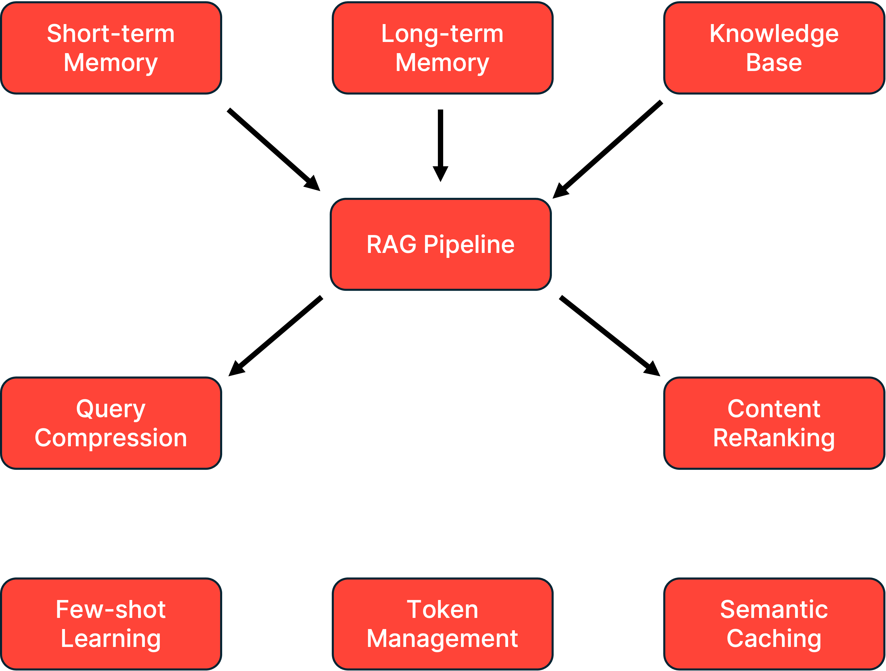

## 🏆 Congratulations!

You've successfully assembled the Context Engineering Workshop for .NET Developers and built an AI application that demonstrates practical context-management patterns for Large Language Models (LLMs). This version of the project includes the original workshop assets plus a separate ASP.NET Core and Semantic Kernel backend scaffold.

## .NET Scaffold

This repo now also includes a minimal ASP.NET Core version in `backend-dotnet-layer/`. It implements only the chat endpoint used by the React UI and serves the built frontend from the .NET app itself.

```bash
docker compose up -d
export OPENAI_API_KEY=your-key
cd frontend-layer && npm run build
cd ..
dotnet run --project backend-dotnet-layer
```

The original workshop `docker-compose.yaml` is left intact for the existing Java/Redis stack. The .NET app runs separately on `http://localhost:8081` by default so it does not collide with the Java backend on `8080`.

## 🎯 What You've Built

### Complete Context Engineering System

Your application now implements a comprehensive context engineering solution with:



## 📚 Context Engineering Techniques Implemented

### 1. **Memory Architectures** (Labs 2 & 5)
- **Technique**: Hierarchical Memory Systems
- **Implementation**: Dual-layer memory with short-term (conversation) and long-term (persistent) storage
- **Reference**: [Memory-Augmented Neural Networks](https://arxiv.org/abs/1410.3916)
- **Benefits**:
   - Maintains conversation coherence
   - Preserves user preferences across sessions
   - Enables personalized interactions

### 2. **Retrieval-Augmented Generation (RAG)** (Labs 3 & 4)
- **Technique**: Dynamic Context Injection
- **Implementation**: Vector-based semantic search with document chunking
- **Reference**: [RAG: Retrieval-Augmented Generation](https://arxiv.org/abs/2005.11401)
- **Benefits**:
   - Access to external knowledge
   - Reduced hallucination
   - Up-to-date information retrieval

### 3. **Query Optimization** (Lab 6)
- **Technique**: Query Compression and Expansion
- **Implementation**: LLM-based query reformulation for better retrieval
- **Reference**: [Query Expansion Techniques](https://dl.acm.org/doi/10.1145/3397271.3401075)
- **Benefits**:
   - Improved retrieval accuracy
   - Reduced noise in search results
   - Better semantic matching

### 4. **Content Reranking** (Lab 6)
- **Technique**: Cross-Encoder Reranking
- **Implementation**: ONNX-based similarity scoring with MS MARCO models
- **Reference**: [Dense Passage Retrieval](https://arxiv.org/abs/2004.04906)
- **Benefits**:
   - Higher relevance in retrieved content
   - Reduced context pollution
   - Better answer quality

### 5. **Few-shot Learning** (Lab 7)
- **Technique**: In-Context Learning (ICL)
- **Implementation**: Example-based prompting in system messages
- **Reference**: [Language Models are Few-Shot Learners](https://arxiv.org/abs/2005.14165)
- **Benefits**:
   - Consistent output format
   - Better instruction following
   - Reduced prompt engineering effort

### 6. **Token Management** (Lab 8)
- **Technique**: Sliding Window Attention
- **Implementation**: Dynamic pruning with token count estimation
- **Reference**: [Efficient Transformers](https://arxiv.org/abs/2009.06732)
- **Benefits**:
   - Prevents context overflow
   - Maintains conversation flow
   - Optimizes token usage

### 7. **Semantic Caching** (Lab 9)
- **Technique**: Vector Similarity Caching
- **Implementation**: Redis LangCache with embedding-based matching
- **Reference**: [Semantic Caching for LLMs](https://arxiv.org/html/2504.02268v1)
- **Benefits**:
   - 40-60% reduction in LLM calls
   - Sub-100ms response times for cached queries
   - Significant cost savings

## 🔧 Technology Stack Mastered

### Core Technologies
- **Java 21**: Modern Java with virtual threads and records
- **Spring Boot 3.x**: Reactive programming with WebFlux
- **LangChain4J**: Comprehensive LLM orchestration

### AI/ML Components
- **OpenAI GPT-3.5/4**: Large language model integration
- **ONNX Runtime**: Cross-platform model inference
- **Vector Embeddings**: Semantic similarity search
- **MS MARCO**: State-of-the-art reranking models

### Infrastructure
- **Docker**: Containerized deployment
- **Redis Cloud**: Semantic caching via LangCache service
- **Agent Memory Server**: Distributed memory management

## 🎓 Advanced Concepts Learned

1. **Context Window Optimization**: Balancing information density with token limits
2. **Semantic Similarity**: Understanding and implementing vector-based search
3. **Prompt Engineering**: Crafting effective system prompts with examples
4. **Memory Hierarchies**: Designing multi-tier memory systems
5. **Query Understanding**: Reformulating user intent for better retrieval
6. **Cache Strategies**: Implementing intelligent caching with semantic matching
7. **Token Economics**: Optimizing cost vs. performance in LLM applications

## 🚀 Next Steps for Your Journey

### Immediate Enhancements

#### 1. **Implement Conversation Summarization**
```java
// Add conversation summary when token limit approached
public String summarizeConversation(List<ChatMessage> messages) {
    // Use LLM to create concise summary
    // Store as long-term memory
    // Clear short-term memory
}
```

#### 2. **Add Multi-Modal Support**
- Integrate image processing with LangChain4J
- Add support for PDF charts and diagrams
- Implement audio transcription for voice queries

#### 3. **Enhance Memory Management**
- Implement memory importance scoring
- Add memory consolidation strategies
- Create user-controlled memory editing

### Advanced Features

#### 1. **Implement Agents and Tools**
```java
@Tool("Search the web for current information")
public String webSearch(String query) {
    // Integrate with search APIs
    // Add to context dynamically
}

@Tool("Execute calculations")
public String calculate(String expression) {
    // Math expression evaluation
    // Return formatted results
}
```

#### 2. **Implement Hybrid Search**
- Combine vector search with keyword search
- Add metadata filtering for better precision
- Implement BM25 + dense retrieval fusion

### Production Considerations

#### 1. **RAG Observability and Monitoring**
```java
public class MyEmbeddingModelListener implements EmbeddingModelListener {

    @Override
    public void onRequest(EmbeddingModelRequestContext requestContext) {
        requestContext.attributes().put("startNanos", System.nanoTime());
    }

    @Override
    public void onResponse(EmbeddingModelResponseContext responseContext) {
        long startNanos = (long) responseContext.attributes().get("startNanos");
        long durationNanos = System.nanoTime() - startNanos;
        // Do something with duration and/or responseContext.response()
    }

    @Override
    public void onError(EmbeddingModelErrorContext errorContext) {
        // Do something with errorContext.error()
    }
}
```

LangChain4J provides a comprehensive [observability framework](https://docs.langchain4j.dev/tutorials/observability) to monitor LLM and embedding model calls.

#### 2. **Security and Privacy**
- Implement PII detection and masking
- Add conversation encryption
- Create audit logs for compliance
- Implement user consent management

#### 3. **Scale and Performance**
- Implement distributed caching with Redis Cluster
- Add connection pooling for LLM calls
- Use async processing for document ingestion
- Implement circuit breakers for resilience

### Learning Resources

#### Research Papers
- [Attention Is All You Need](https://arxiv.org/abs/1706.03762)
- [BERT: Pre-training of Deep Bidirectional Transformers](https://arxiv.org/abs/1810.04805)
- [Constitutional AI](https://arxiv.org/abs/2212.08073)

#### Online Courses
- [CS324 - Large Language Models (Stanford)](https://stanford-cs324.github.io/winter2022/)
- [Full Stack LLM Bootcamp](https://fullstackdeeplearning.com/llm-bootcamp/)
- [Semantic Caching for AI Agents](https://www.deeplearning.ai/short-courses/semantic-caching-for-ai-agents/)

### Community and Contribution

#### Join the Community
- [LangChain4J Discord](https://discord.com/invite/JzTFvyjG6R)
- [Redis Developer Community](https://discord.gg/redis)

#### Contribute Back
- Share your improvements as PRs
- Write blog posts about your learnings
- Create video tutorials
- Help others in community forums

## 🏅 Certification of Completion

You've demonstrated proficiency in:
- ✅ Context Window Management
- ✅ Memory System Architecture
- ✅ Retrieval-Augmented Generation
- ✅ Query Optimization Techniques
- ✅ Semantic Caching Strategies
- ✅ Token Economics and Management
- ✅ Production-Ready AI Applications

## 🙏 Acknowledgments

This workshop was made possible by:
- The LangChain4J community
- Redis Developer Relations team
- All workshop participants and contributors

## 📬 Feedback and Support

- **Workshop Issues**: update this link after the new repository is published
- **Improvements**: PRs are welcome!

---

**Thank you for joining us on this Context Engineering journey!**

You're now equipped with the knowledge and tools to build sophisticated, production-ready AI applications. The future of context-aware AI is in your hands. Go forth and build amazing things! 🚀

---
